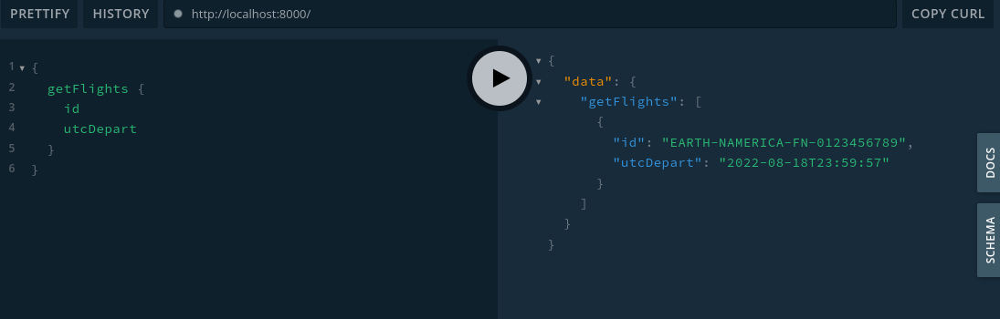
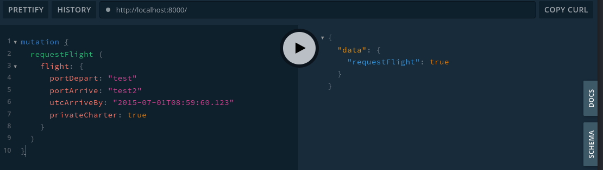

# axum + graphql

## Stack

| Library | Version | Description
| --- | --- | --- |
| axum | [0.5.15](https://docs.rs/axum/0.5.15/axum/) | `tokio` for async runtime and utilities<br>`hyper` for http server<br>`tower` for  middleware and utilities<br>Includes `tonic` (gRPC)
| async-graphql | [4.0.9](https://crates.io/crates/async-graphql) | |

## Try It

1. Start the server
```bash
$ cargo run
    Finished dev [unoptimized + debuginfo] target(s) in 0.07s
     Running `target/debug/axum-graphql`
Playground live at http://localhost:8000/
```

2. Visit the URI in your browser.
3. Try the `getFlights` request with any field:

4. Try the `requestFlight` mutation (returns `true`):

5. Click `SCHEMA` or `DOCS` to get more information.


## Resources
- [Joel Parker Henderson - Axum Tutorial](https://github.com/joelparkerhenderson/demo-rust-axum)
- [Roman Kudryashov - GraphQL in Rust](https://romankudryashov.com/blog/2020/12/graphql-rust/)
