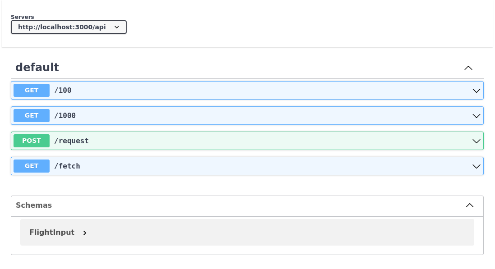

# poem + REST
## Stack

| Library | Version | Description
| --- | --- | --- |
| poem | [1.3.40](https://crates.io/crates/poem) | 
| poem-openapi | [2.0.10](https://crates.io/crates/poem-openapi) |

## Try It

1. Start the server
```bash
$ cargo run
   Compiling poem-rest v0.1.0
    Finished dev [unoptimized + debuginfo] target(s) in 3.89s
     Running `target/debug/poem-rest`
Live! Visit http://localhost:8000
```

2. Visit the URI in your browser.


3. Use `curl` to send a request
```bash
curl -X 'POST' \
'http://localhost:8000/api/request-flight' \
-H 'accept: application/json' \
-H 'Content-Type: application/json' \
-d '{
  "port_depart": "string",
  "port_arrive": "string",
  "utc_arrive_by": "2022-08-18T23:59:57",
  "private_charter": true
}'
```